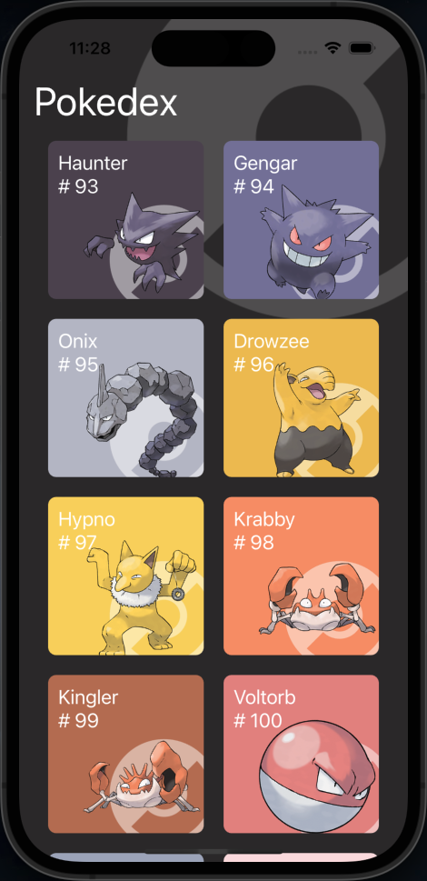
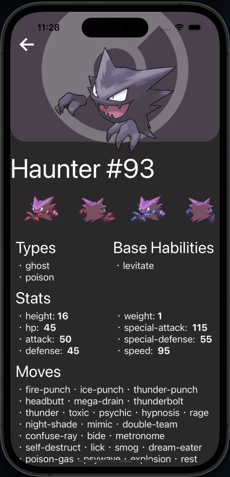
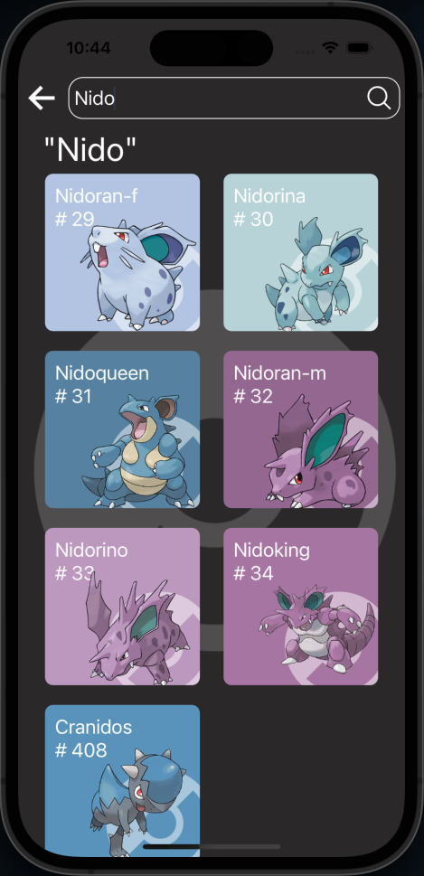

<h1 align="center">Pokedex App 🐉</h1>

## Overview 📘
App that shows Pokenons by number, the pokemons information are fetching from PokeApi.

## Scrennshots 📷
  

## Features 🕹️
- See the pokemons by number
- Pokemons lazy loaded on an infinite scroll
- See details of the pokemons
- Search screen, search by number and name

## Technologies 💻
* React Native CLI
* Typescript

## How to use ⚙️
- Run the following commands after cloning the project
```
yarn install
npx pod-install ios
```
- The next step is run the following command to run the app on your terminal
- Make sure you have all the necessary environment setup required for running an Android or iOS simulator
```bash
yarn run ios

# you can run the app on android just replacing ios word for android  word
```
